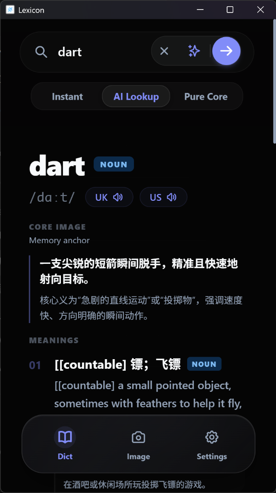
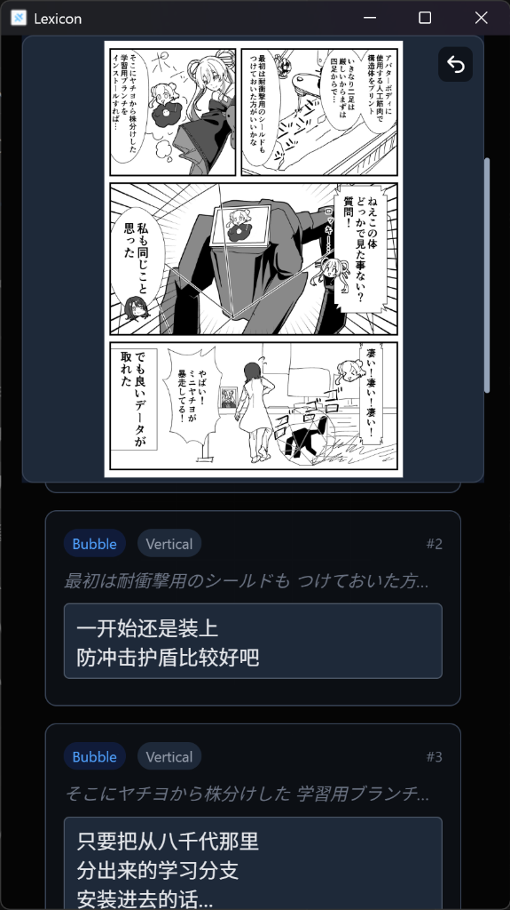
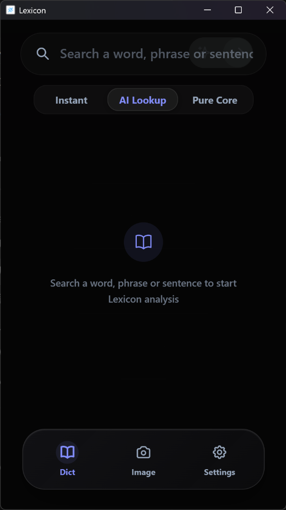
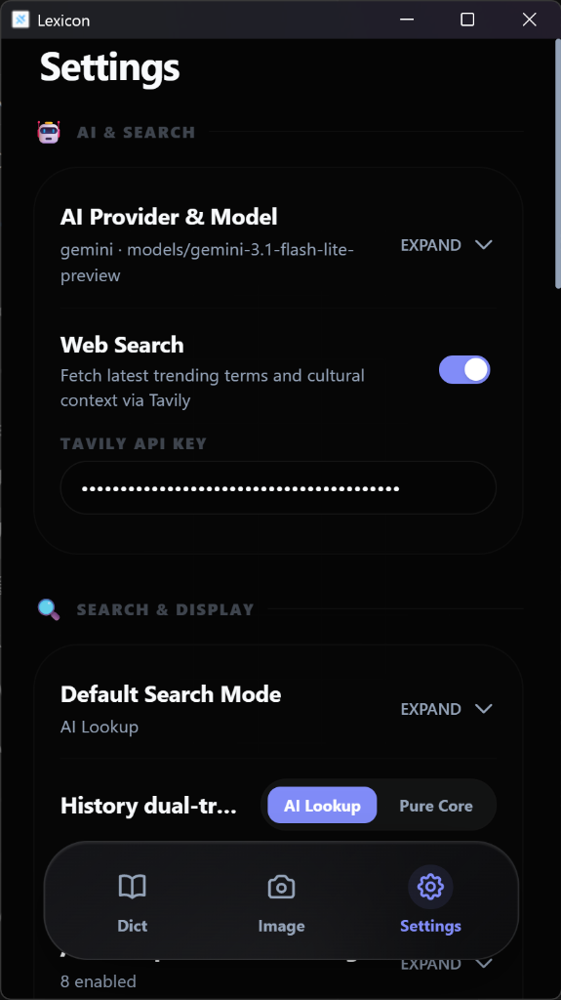

# Lexicon

**AI 驱动的浏览器、桌面与移动端英语深度查词与语境理解工具** | **[English Version](./README_en.md)**

> 💡 **不是背单词软件，而是面向阅读与运用的英语深度助手。**  
> Lexicon 结合**离线双本地词库（牛津 9 中英双解 + 牛津 10 纯英英）**与**多模态 AI 语境解析**。它不搞死记硬背与强迫复习，而是帮助你在阅读英文书籍、论文、漫画及写作时，**瞬时查询释义，彻底搞懂单词在真实语境中的情感色彩、感觉锚点、介词隐喻与母语者用法**。

---

## 🖼️ 真实软件界面展示 (Real Application Screenshots)

| 极速 AI 查词与记忆锚点 (AI Lookup) | 漫画与截图 OCR 对照翻译 (Comic Translation) |
| :---: | :---: |
|  |  |
| *以 `dart` 为例：显示音标、CORE IMAGE 感觉锚点与深层释义* | *导入日漫/英漫，自动 OCR 提取文字并在下方生成双语对照* |

| 简洁主界面与三大查词模式 (Home Screen) | 自由 AI 服务商与联网配置 (Settings) |
| :---: | :---: |
|  |  |
| *极简玻璃拟态 UI，支持 Instant / AI Lookup / Pure Core 模式* | *配置 Gemini (Flash Lite)、DeepSeek、OpenAI、Ollama 与 Tavily / Brave 联网搜索* |

---

## 💡 为什么选择 Lexicon？

市面上有许多单词记忆软件（如 Anki、墨墨等），它们侧重于刷词表与卡片算法复习。而 Lexicon 的设计初衷截然不同：

1. **不搞死记硬背**：我们坚信“背单词”不如“在语境中搞懂单词”。Lexicon 专注服务于阅读、翻译、漫画字幕与写作场景。
2. **零延迟离线查词**：内置完整的牛津高阶第 9 版（中英双解 5.2 万）与第 10 版（纯英英 8.4 万）SQLite 本地词库，启动即用，无网络也能离线秒查。
3. **AI 深度双轨解析**：除了传统词典释义，AI 能为你拆解词汇的感情色彩、词源脉络、近义词心智辨析及句子练习。
4. **认知语言学介词隐喻**：图文拆解 `up` / `out` / `off` 等核心介词的空间隐喻与认知逻辑，掌握地道介词搭配。
5. **漫画与截图多图并行翻译**：专为喜欢看英文漫画、讲义、截图的用户设计，支持批量 OCR、平移无级缩放与双语对照预览。

---

## 🚀 核心功能特色

### 1. 三种深度查词模式
- **Instant (极速模式)**：纯本地词库，0 延迟，离线可用。输入框外词汇自动触发 AI 合并搜索。
- **AI Lookup (记忆与理解)**：呈现本地 L1 释义同时，AI 淡入生动场景意象、词根助记、例句核对练习与随身 Q&A 追问（支持 Markdown 排版与自适应对比表格）。
- **Pure Core (母语者用法与感觉锚)**：摒弃传统“中文释义墙”，直接展示**用法意象（短对译 gloss / 感觉锚 / 情绪底色）**、概念树、语境搭配、语域与造句练习。支持模组拖拽排序。
- **多行自适应输入**：主搜索框与 AI 提问框支持 1 至 4 行自适应扩展（严格换行，不溢出），移动端光标调准更流畅。
- **双轨缓存与对比**：单次 AI 请求同时生成 Lookup 与 Pure Core 两套分析，双轨缓存支持 0 秒无缝对比切换。
- **个人画像与弱点热度引擎**：内置学习画像引擎，自动根据练习记录识别薄弱语法点与混淆项，按置信度与时间衰减排序并分层；在单词查询、Pure Core 与追问中智能注入画像上下文，遇到薄弱点即时弹出轻量 Chip 提示。

### 2. 离线双本地词库与智能路由
- **权威双词库**：牛津高阶第 9 版中英双解（约 5.2 万条）+ 第 10 版纯英英（约 8.4 万条）。
- **单语/双语热切换**：随时独立切换英英与中英双解模式，自动调整排版。
- **中文反向路由**：输入中文时自动匹配最佳地道英文对应词，并以母语者心智解析用法。

### 3. 认知语言学介词空间意象
- 覆盖核心隐喻性介词（如 `up` / `out` / `off` / `through` 等）的认知拆解。
- 支持单条意象「换一个」局部刷新，帮助建立空间直觉。

### 4. 漫画 / 截图多图翻译 (Image & Comic Translation)
- **相机拍照与本地多图导入**：支持全平台（iOS / Android / Web / PC）相机拍照直接捕获实时文本，或一次性导入多张本地图片，进行并行 OCR 与 AI 翻译。
- **高帧率平移与无级缩放**：内置缩放查看器，原图与双语翻译版本秒级叠加对比。
- **对比浏览与无痕暂存**：支持原图与双语译文左右/重叠对照阅读。

### 5. 自由 AI 引擎与联网搜索（Tavily / Brave）
- **支持全球主流 AI 平台**：原生支持 Google Gemini、OpenAI、DeepSeek、Claude、OpenRouter、硅基流动等云端服务，以及 Ollama 本地私密模型。
- **实时联网补全（Tavily / Brave Search）**：遇到最新流行语、专业缩写或冷门词汇时，AI 可实时检索全球最新网讯进行增强解析。可在设置中按钮式切换搜索服务商，两个 API Key 各自独立保存；关闭「Web Search」开关即彻底停用联网检索。
  - Tavily 四端（Web / 桌面 / Android / iOS）均可用；**Brave 因浏览器 CORS 限制，仅桌面端与移动端可用**（网页版会给出提示）。
- **联网配图**：结果页可为义项配一张联网检索到的图片；某张加载失败会自动尝试下一张，均不可用时显示「无图」占位。

### 6. 全平台多端覆盖
- **桌面端**：Windows (Tauri v2) / macOS (dmg)
- **移动端**：Android (APK) / iOS (Capacitor 8)
- **浏览器扩展端**：Windows / macOS 上的 Chrome、Edge 与其他 Chromium 浏览器（MV3 侧边栏常驻、网页划词、右键/快捷键查词；源码构建：npm run pack:ext）
- **Web 端**：WASM SQLite 离线运行

---

## 🌐 浏览器扩展（Preview）

Lexicon 浏览器扩展完整复用 App 的 Dict / Image / Settings 界面与 Instant、AI Lookup、Pure Core 三种模式。在 Windows 和 macOS 的 Chrome、Edge 等 Chromium 浏览器中，它以 Side Panel 常驻侧栏运行，设置、历史和 AI 缓存均保存在浏览器本地。

### 下载与首次安装

1. 打开 [Browser Extension Preview Release](https://github.com/jimytao/lexicon/releases/tag/extension-preview)，在页面底部的 **Assets** 中下载最新版本：
   - Windows / Linux：`lexicon-extension-<版本号>.zip`
   - macOS：`lexicon-extension-<版本号>-macos.zip`
   - 两个包的功能相同；不要下载 Source code，也不需要下载任何 `.db` 文件。
2. 将 ZIP **完整解压**到一个准备长期保留的文件夹，例如 `Documents/Lexicon Extension`。不要直接在压缩包内打开，也不要在安装后删除或移动这个文件夹。
3. 打开浏览器扩展管理页：
   - Chrome：在地址栏输入 `chrome://extensions`
   - Edge：在地址栏输入 `edge://extensions`
4. 打开页面右上角或左侧的「开发者模式（Developer mode）」。
5. 点击「加载已解压的扩展（Load unpacked）」，选择刚才解压出来、**里面直接能看到 `manifest.json`** 的文件夹。如果外面还有一层同名目录，请进入内层后再选择。
6. 安装成功后，可将 Lexicon 固定到浏览器工具栏；点击 Lexicon 图标即可打开侧栏。首次查词会自动下载默认中英双解词库，下载完成后即可离线使用 Instant 查词。

### 更新 Extension

Extension 的版本号随 Lexicon 主版本同步。检测到新版本时，扩展内会显示更新提示；点击提示会直接打开上面的 [Browser Extension Preview Release](https://github.com/jimytao/lexicon/releases/tag/extension-preview)。当前 Preview 采用开发者模式安装，不会像商店扩展一样自动替换文件。

1. 从 Release 的 **Assets** 下载对应系统的最新版 ZIP，并完整解压。
2. 推荐用新版解压目录替换旧版目录，同时保持最终目录位置不变；不要把新版文件零散混入旧目录。
3. 回到 `chrome://extensions` 或 `edge://extensions`，找到 Lexicon，点击卡片上的「重新加载（Reload）」按钮。
4. 打开 Lexicon 侧栏，在 **Settings → 当前版本** 确认版本号已经更新。

浏览器本地保存的设置、历史、AI 缓存和已下载词库存放在扩展自己的存储空间。使用相同的 Extension ID 正常覆盖并重新加载时会继续保留；如果先删除扩展再重新安装，浏览器可能同时清除这些本地数据，因此更新时不要点击「移除」。

### 常见安装问题

- 浏览器提示找不到 manifest：选择错了目录，请选择其中直接包含 `manifest.json` 的那一层。
- 更新后仍显示旧版本：确认已覆盖完整目录，并在扩展管理页点击「重新加载」；必要时关闭后重新打开侧栏。
- 扩展目录被删除或移动后失效：把目录放回原位置，或在扩展管理页移除失效项后重新「加载已解压的扩展」。
- 公司或学校管理的浏览器可能禁用开发者模式；这种策略限制无法由 Lexicon 绕过。

> dictionaries Preview Release 中的 lexicon.db 和 lexicon_en.db 是扩展自动管理的远程词库资产，用户无需手动下载。lexicon.db 是默认中英双解词库；只有在 Settings 切换为英英模式时，扩展才会按需下载 lexicon_en.db。

### 网页划词
 
- 在网页中选中文字，浮动查词按钮智能贴合选区末端：点击按钮即可打开侧栏并立即查询。
- 也可以右键选择 Lexicon；Windows / Linux 按 `Alt+L`，macOS 按 `Command+Shift+L` 查询当前选区。
- 如果 Chromium 因页面或手势限制未能自动打开侧栏，查询不会丢失；手动点击一次 Lexicon 图标后会继续显示该查询。
- 可在 Settings 关闭网页选词按钮。扩展只读取用户主动选中的文本，不读取整页正文。

---
## 📦 下载安装 (Download & Install)

> 🔄 **软件内自动更新提示 (Auto-Update Notice)**：  
> **Windows** 桌面端与 **Android** 移动端原生支持**软件内自动检测与一键升级**。当发布新版本时，软件会自动弹出更新提醒，您也可在 Settings 设置页面直接检查更新并在线升级，无需每次重新手动下载安装包。

### Windows
- **[Lexicon_0.9.23_x64-setup.exe](https://github.com/jimytao/lexicon/releases/download/v0.9.23/Lexicon_0.9.23_x64-setup.exe)**（推荐，支持软件内自动更新）
- **[Lexicon_0.9.23_x64_en-US.msi](https://github.com/jimytao/lexicon/releases/download/v0.9.23/Lexicon_0.9.23_x64_en-US.msi)**（MSI 安装包）

### macOS 桌面端 (v0.9.23)
- **[Lexicon_0.9.23_universal.dmg](https://github.com/jimytao/lexicon/releases/download/v0.9.23/Lexicon_0.9.23_universal.dmg)**（通用二进制，原生支持 Apple Silicon M1-M4 及 Intel Mac）

> **⚠️ macOS 首次打开提示“无法验证开发者”或“已损坏”解决方案（三种方式）：**  
> 由于独立开源版本未购买 Apple 付费开发者 ID 证书，macOS Gatekeeper 默认会阻挡未签名应用。请按以下任意一种方法解除限制：
> 1. **右键打开 (推荐 & 最简单)**：将下载的 `Lexicon.app` 拖入 `Applications` (应用程序) 文件夹后，按住键盘 `Control` 键并右键点击 `Lexicon` 图标选择「打开」，在弹出的系统安全确认框中点击「打开」即可正常运行。
> 2. **系统设置安全授权**：若被直接阻挡，打开 Mac 的「系统设置 → 隐私与安全性」，向下滚动到“安全性”一栏，找到“已阻止使用 Lexicon”提示，点击右侧的「仍要打开 (Open Anyway)」。
> 3. **终端清除隔离属性 (终极解决方案)**：若系统弹窗提示“应用已损坏，无法打开”，打开 macOS「终端 (Terminal)」应用，输入以下命令并回车（需要输入 Mac 开机密码）：  
>    ```bash
>    sudo xattr -rd com.apple.quarantine /Applications/Lexicon.app
>    ```

### Android 手机 / 平板 (v0.9.23)
- **[Lexicon_0.9.23_universal_signed.apk](https://github.com/jimytao/lexicon/releases/download/v0.9.23/Lexicon_0.9.23_universal_signed.apk)**（推荐通用包，支持软件内自动检测升级）
- 更多架构分包请见 [Releases v0.9.23](https://github.com/jimytao/lexicon/releases/tag/v0.9.23)。

### iOS（自签侧载）
1. 安装 **[Sideloadly](https://sideloadly.io/)**（需官网版 iTunes + iCloud）。
2. USB 连接 iPhone，解锁并信任电脑。
3. 从 GitHub Releases 下载 `.ipa` 包拖入 Sideloadly，使用 Apple ID 签名安装。
4. 首次启动前：系统设置 → 通用 → VPN 与设备管理 → 信任你的 Apple ID。

---

## ⚙️ 配置 API Key 与服务指南 (AI Setup)

为了解锁 AI 深度解析能力，您只需在设置中配置喜欢的 AI 密钥。Lexicon 原生支持 OpenAI 兼容协议与 Google Gemini 官方协议。

> **💡 模型选择建议**：大模型更新迅速，在查词分析与语言学习场景下，**强烈建议优先选择各大平台主打「轻量极速、成本低廉」的小模型系列**（如 `gemini-3.1-flash-lite-preview` / `Flash` / `Flash Lite` / `Mini` / `Haiku` / `Small` 等）。

| AI 服务商 | 官方 API Key 申请平台 | 推荐模型系列 |
|---|---|---|
| **Google Gemini** | [Google AI Studio](https://aistudio.google.com/app/apikey) | `Flash` / `Flash Lite` 系列（极速免费/低成本） |
| **DeepSeek** | [DeepSeek 开放平台](https://platform.deepseek.com/api_keys) | `DeepSeek Chat` 轻量高速模型 |
| **OpenAI (ChatGPT)** | [OpenAI API Platform](https://platform.openai.com/api-keys) | `gpt-4o-mini` 等轻量系列 |
| **OpenRouter** | [OpenRouter Keys](https://openrouter.ai/keys) | 聚合全球模型，选择带 `Flash` / `Mini` 标识的模型 |
| **SiliconFlow (硅基流动)** | [硅基流动 Cloud](https://cloud.siliconflow.cn/account/ak) | 选择 `DeepSeek` / `Qwen` 托管的轻量高速模型 |
| **Anthropic (Claude)** | [Anthropic Console](https://console.anthropic.com/settings/keys) | `Claude Haiku` 轻量系列 |
| **Ollama (本地私有大模型)** | [Ollama 官网](https://ollama.com/) | 零费用私密模型，配置 Endpoint 填 `http://localhost:11434/v1` |
| **Tavily (网络实时搜索)** | [Tavily AI Platform](https://tavily.com/) | 专为 AI 实时联网查词设计的 Web 搜索 API |
| **Brave Search (网络实时搜索)** | [Brave Search API](https://brave.com/search/api/) | 独立索引的 Web 搜索 API；Tavily 之外的可选联网服务商（桌面端 / 移动端可用，网页版受浏览器 CORS 限制） |

### 快速配置 5 步走：
1. 从上表申请复制您的 API Key。
2. 打开 Lexicon，点击底栏最右侧 **Settings**。
3. 在 **「AI 服务商与模型」** 栏选择厂商并粘贴 API Key。
4. 点击 **「获取模型 (Fetch Models)」** 下拉选择模型（推荐 Flash / Mini）。
5. 点击 **「测试连接」** 校验成功后即可开始使用！

---

## ⌨️ 常用快捷技巧

- **Ctrl + Enter**：强制发起 AI 全量搜索。
- **搜索栏 AI 图标 (✨)**：绕过本地词库直接调用 AI 深度解析。
- **图片与漫画流程**：拍照/导入图片 → 批量翻译 → 对照阅读。
- **缓存管理**：可在 Settings 页面底部一键清理历史与缓存。

---

## 🛠️ 本地开发与打包

需要 [Node.js](https://nodejs.org/) LTS (≥ 18)。

```bash
git clone https://github.com/jimytao/lexicon.git
cd lexicon
npm install
npm run dev
```

浏览器打开终端提示的地址（如 `http://localhost:5173/`）。

### 构建打包
```bash
npm run build
npm run tauri:build
npx cap sync android && cd android && ./gradlew assembleRelease
```

更多构建细节请参考 [`workflow.md`](./workflow.md) 与 [`AGENT.md`](./AGENT.md)。

---

## 🧱 技术栈 (Tech Stack)

- **前端/逻辑**：React 18 + TypeScript (strict) · Vite 6 · Tailwind CSS v4 · Zustand
- **本地词库/OCR**：sql.js (SQLite WASM) · Tesseract.js
- **跨平台原生**：Tauri v2 (Desktop) · Capacitor v8 (Mobile)

---

## License

[MIT License](LICENSE)
